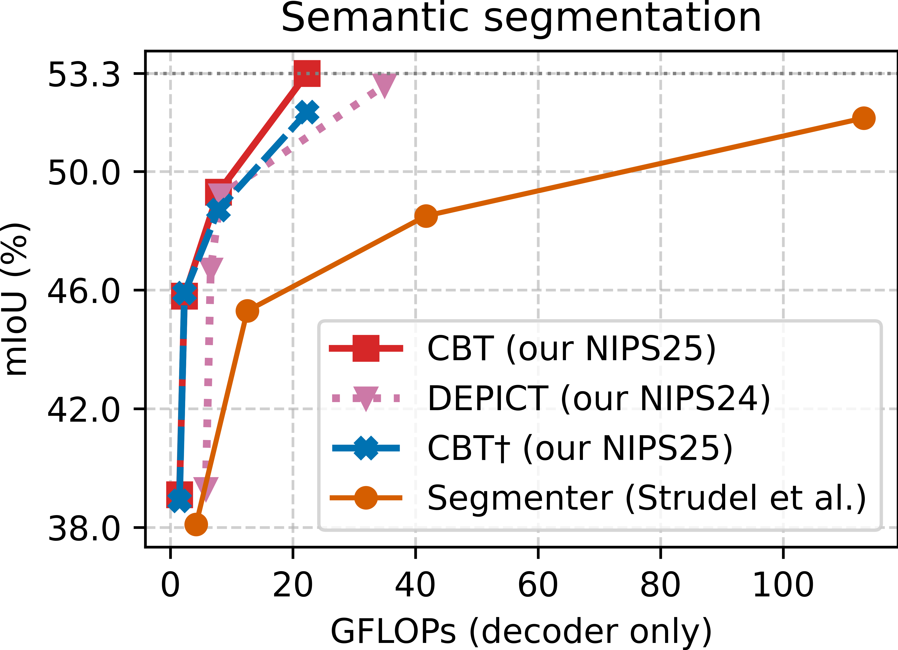
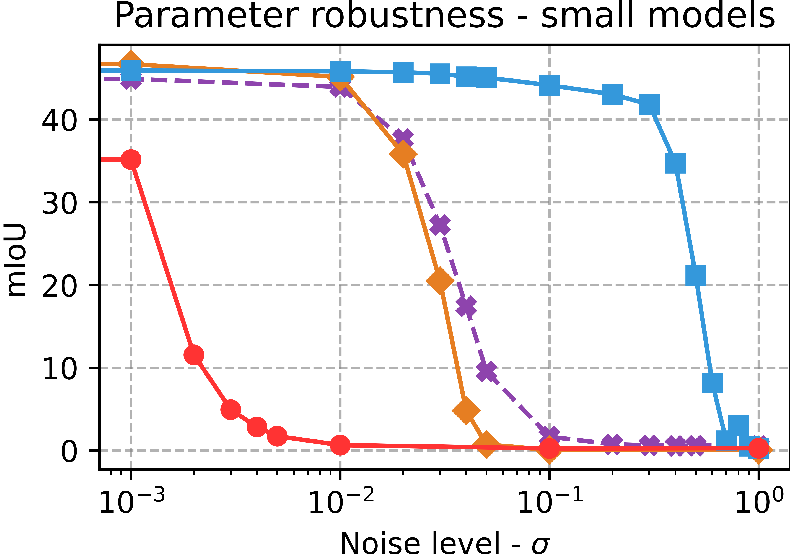

# DEPICT (DEcoder for PrIncipled semantiC segmenTation)

This repository is the official Pytorch implementation of paper [Rethinking Decoders for Transformer-based Semantic Segmentation: A Compression Perspective](https://arxiv.org/abs/2411.03033) by Qishuai Wen and [Chun-Guang Li](https://teacher.bupt.edu.cn/cgli/zh_CN/index.htm), NeurIPS2024.
<p align="center">  <br> <em>DEPICT overview</em> </p>

## 📣 News 
[2025/9/19] Our follow-up paper has been accepted to NeurIPS 2025 as a Spotlight🌟! See [CBSA](https://github.com/QishuaiWen/CBSA).

[2024/9/26] This paper has been accepted to NeurIPS 2024 as a Poster!
## Models
We release our models trained on the ADE20K dataset, including variants of [DEPICT-SA](https://drive.google.com/drive/folders/1feq6ldmup86Qdav7GVX9rYWQqufiHtSJ?usp=drive_link) and [DEPICT-CA](https://drive.google.com/drive/folders/1Zaz43QPTcHnYVlPGlZUXfTruag93wBG7?usp=drive_link).

<div align="center">
  
  
  
  <br>
  <em>Performance comparison</em>
</div>

## Reproduction&Training Guidelines
Install [Segmenter](https://github.com/rstrudel/segmenter) via  
```
git clone https://github.com/rstrudel/segmenter ./segmenter
```
or otherwise, and prepare the datasets by following the instructions in [Segmenter](https://github.com/rstrudel/segmenter).  
For example, run
```
pip install -r requirements.txt  
export DATASET=datasets  
python -m segm.scripts.prepare_ade20k $DATASET  
```
Additionally, run
```
pip install scipy
```
and create a new folder named "log".  
Once done, the file structure is as follows:  
```
segmenter/  
├── datasets/  
│   ├── ade20k  
│   │   ├── ADEChallengeData2016  
│   │   └── release_test  
│   └── ...  
├── log/  
├── segm/  
│   ├── model/  
│   ├── config.py  
│   └── ...  
├── requirements.txt  
└── ...  
```
Then replace the folder "model" and the file "config.py" with ours, and upload our our model folders, such as "DEPICT-SA-Small", into the folder "log".  
Finally, evaluate the models via
```
# single-scale evaluation:
python -m segm.eval.miou log/DEPICT-SA-Small/checkpoint.pth ade20k --singlescale
# multi-scale evaluation:
python -m segm.eval.miou log/DEPICT-SA-Small/checkpoint.pth ade20k --multiscale
```
or re-train it via 
```
python -m segm.train --log-dir log/DEPICT-SA-Small --dataset ade20k --backbone vit_small_patch16_384 --decoder mask_transformer
```
P.S. To evaluate DEPICT-CA, line 19 of model/decoder.py should be "mode='ca'". We aim to make minimal modifications to the Segmenter code, keeping all differences confined to the config.yml file and the model folder we released above.

## Acknowledgements
Our work and code are inspired by and built upon [CRATE](https://github.com/Ma-Lab-Berkeley/CRATE) (Yu et al., 2023) and [Segmenter](https://github.com/rstrudel/segmenter) (Strudel et al., 2021). The source of the above image examples is [d2l.ai](https://d2l.ai/chapter_computer-vision/semantic-segmentation-and-dataset.html#fig-segmentation).
